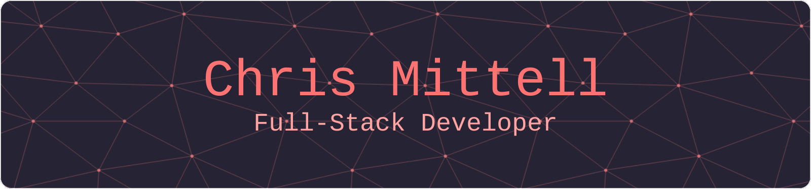

<!--
-->

# :wave: About

Hi, I'm Chris, a Full-Stack Developer from the UK :uk: and currently living in Nagoya, Japan :jp:

 - :eyeglasses: I'm currently learning React, Next.js, Node, TypeScript.
 - :neckbeard: I have over 6 years experience building Web Applications and APIs.
 - :astonished: I've also worked with Vue 3, C#, .NET Core, .NET Framework, Microsoft SQL Server, and Microsoft Azure.

# :books: My Stack

 
### Front-end

### Back-end

### Database

### Testing

### CI/CD

### Containers

# :grin: My Projects:

# :bar_chart: GitHub Stats

---

Made with :heart: and :joy:

